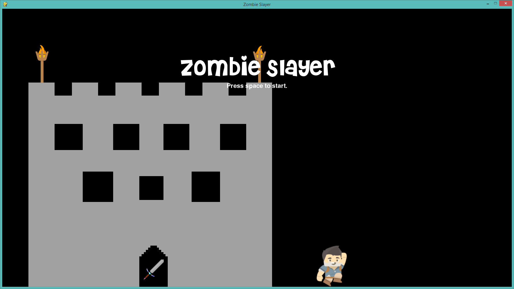
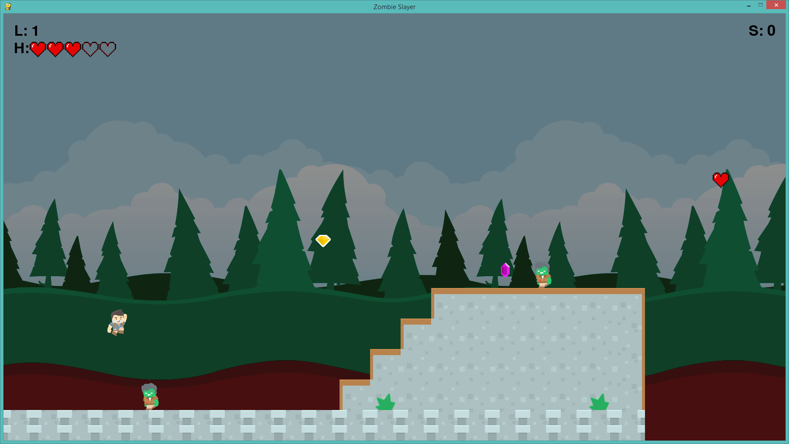
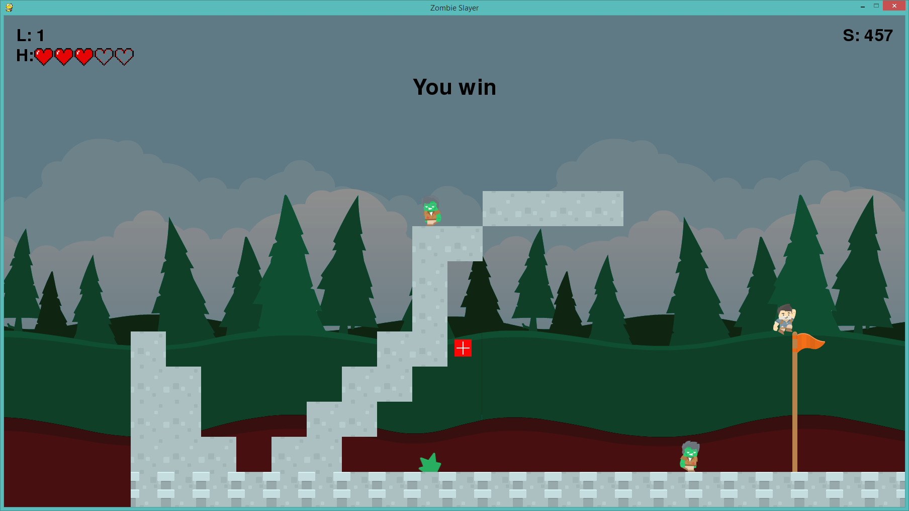
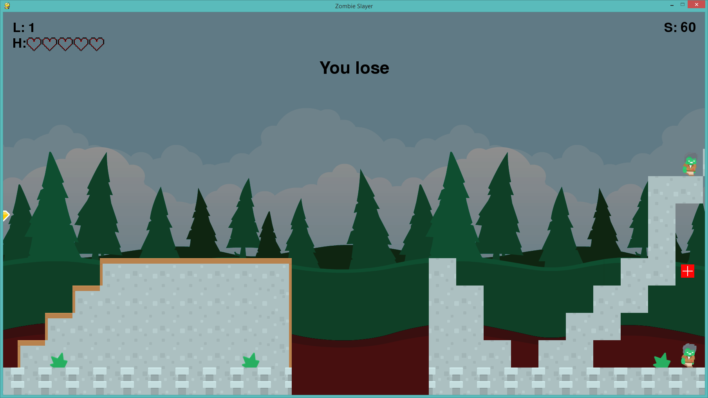

# Zombie Slayer

## About
In the year 2045, the first reanimated body ascended from the dead and began to terrorize NYC. Now that the world is being taken completely over, the government has sent out a request for any citizens to assist. These zombies are not the brightest but watch out because they will stop at nothing to kill you. You have been called to the mountains of Virginia to help save the world so kill as many zombies as you can and make sure to reach the end and jump as high as you can on the flagpole to score points and stop world domination. The world depends on you!

## How to Play
Use the arrow keys to move left and right as well as the space bar to jump on top of the zombies. When you land one time on top of any zombie, it will be killed and you will be awarded 10 points for each one. Collect any gems, coins, or the sword to get more points and reach a high score! The heart will give you an extra life if you can pick it up and the life pack in the first level will give you an extra available heart so that you can collect more lives. To get as many points as possble, jump to the top of the flag at the end and receive a higher score bonus.

##Download Here
[Zombie Slayer](https://github.com/IanT0305/Zombie-Slayer/releases/download/v1.0/Zombie.Slayer.exe)

## Start Screen

## Gameplay

As you can see, your character can jump and land on top of those zombies to kill them.

### Winning

The character can jump and land on the flag at the end to win the game and gain points as seen in the top right corner.

### Losing

Falling down an empty space in the bottom will result in zero lives and a complete loss of the game.
